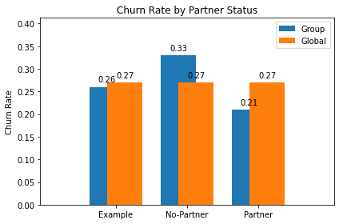

Transcription of [[course-zoomcamp/03-classification/notes/notebook#3 5 Feature importance Churn rate and risk ratio]]
## 3.5 Feature importance: Churn rate and risk ratio

Feature importance analysis (part of EDA) - identifying which features affect our target variable

* Churn rate
* Risk ratio
* Mutual information - later

Now we can look at churn rate by demographic.


#### Churn rate

```python
df_full_train.head()
```

For example, gender. Let's see churn rate among female customers

```python
churn_female = df_full_train[df_full_train.gender == 'female'].churn.mean()
churn_female
```

Churn rate for female customers is pretty close to the global churn rate.

```python
churn_male = df_full_train[df_full_train.gender == 'male'].churn.mean()
churn_male
```

Churn rate for female customers is pretty close to the global churn rate as well.

```python
global_churn = df_full_train.churn.mean()
global_churn
```

```python
global_churn - churn_female
```

```python
global_churn - churn_male
```

Let's see for churn rate for customers who live with partners.

```python
df_full_train.partner.value_counts()
```

```python
churn_partner = df_full_train[df_full_train.partner == 'yes'].churn.mean()
churn_partner
```

```python
global_churn - churn_partner
```

This is noticably less than the global rate.

```python
churn_no_partner = df_full_train[df_full_train.partner == 'no'].churn.mean()
churn_no_partner
```

```python
global_churn - churn_no_partner
```

This is noticably *more* than the global rate. It seems to be about 6% less for those with partners and 6% more for those without partners.

It seems that *gender* does not matter for churn, where as having a *partner* does matter. This brings us to our first point.


### 1. **Churn rate** 
Difference between mean of the target variable and mean of categories for a feature. If this difference is greater than 0, it means that the category is less likely to churn, and if the difference is lower than 0, the group is more likely to churn. The larger differences are indicators that a variable is more important than others.
- If group rate churn rate < global churn rate
    - Group is less likely to churn
- If group rate churn rate > global churn rate
    - Group is *more* likely to churn


Instead of comparing them, we can divide one by another, bringing us to our second point.


#### Risk ratio


Dividing the group churn rate by the global churn rate.

```python
churn_no_partner / global_churn
```

The risk ratio for the no-partner group is greater than 1. They are *more* likely to churn.

```python
churn_partner / global_churn
```

The risk ratio for the partner group is less than 1. They are *less* likely to churn. To explain risk ratio:


### 2. **Risk ratio** 
Ratio between mean of categories for a feature and mean of the target variable. If this ratio is greater than 1, the category is more likely to churn, and if the ratio is lower than 1, the category is less likely to churn. It expresses the feature importance in relative terms. 
- Risk = group / global
    - \> 1: more likely to churn
    - < 1: less likely to churn


We can see that the no-partner group is about 22% higher, the partner group is about 24% lower. Let's visualize this.

```python
labels = ['Example', 'No-Partner', 'Partner']

x = np.arange(len(labels))  # the label locations
width = 0.5  # the width of the bars

fig, ax = plt.subplots()
rects1 = ax.bar(x - width/4, [round(global_churn-0.01, 2), round(churn_no_partner, 2), round(churn_partner, 2)], width, label='Group')
rects2 = ax.bar(x + width/4, [round(global_churn, 2), round(global_churn, 2), round(global_churn, 2)], width, label='Global')

# Add some text for labels, title and custom x-axis tick labels, etc.
ax.margins(0.25)
ax.set_ylabel('Churn Rate')
ax.set_title('Churn Rate by Partner Status')
ax.set_xticks(x, labels)
ax.legend()

ax.bar_label(rects1, padding=4)
ax.bar_label(rects2, padding=4)

fig.tight_layout()

plt.show()
```



- For the control group, we see there is about the same risk as every other user.
- For the no-partner group, the risk ratio is 22%. They are **high risk**.
- For the partner group, the risk ratio is -6%. They are **low risk**.


We can implement something like this in SQL.


```
SELECT
    gender,
    AVG(churn),
    AVG(churn) - global_churn AS diff,
    AVG(churn) / global_churn AS risk
FROM
    data
GROUP BY
    gender;
```


Let's translate this to Pandas

```python
from IPython.display import display
```

```python
df_full_train.groupby('gender').churn.mean()
```

Need multiple statistics. Can use **.agg()** for this:

```python
df_group = df_full_train.groupby('gender').churn.agg(['mean', 'count'])
df_group['diff'] = df_group['mean'] - global_churn
df_group['risk'] = df_group['mean'] / global_churn
df_group
```

Want to do this for every categorical variable

```python
# Need ipython display to make this look nice.
for category in categorical:
    print(category)
    df_group = df_full_train.groupby(category).churn.agg(['mean', 'count'])
    df_group['diff'] = df_group['mean'] - global_churn
    df_group['risk'] = df_group['mean'] / global_churn
    display(df_group)
    print()
    print()
```

- Senior citizens are more likely to churn
- People who have no partner are more likely to churn (vs less likely for partnered)
    - Important: Predictive power
- People who have no dependents are more likely to churn (vs less likely for with dependents)
    - Similar to partner
- Approximately the same for people with phone service
- People who have no phone service are much less likely, one line slightly less, multiple lines slightly likelier
- People with no internet are very likely to stay
- People with fiber optic internet are at high risk of churn
- People without online backup, device protection or tech support are highly likely to churn
- People with month-to-month are more likely to churn (people with long contracts are very unlikely to churn)
- People with paperless billing are more likely to churn
- People who pay with electronic check are highly likely to churn

A customer with, say, no partner, no kids, and a month-to-month plan are very likely to churn.
- Very unlikely for the opposite


Variables with a high risk ratio are the kind we want to use for ML algorithms.

It would be useful to have a number to describe how important a variable is overall.
