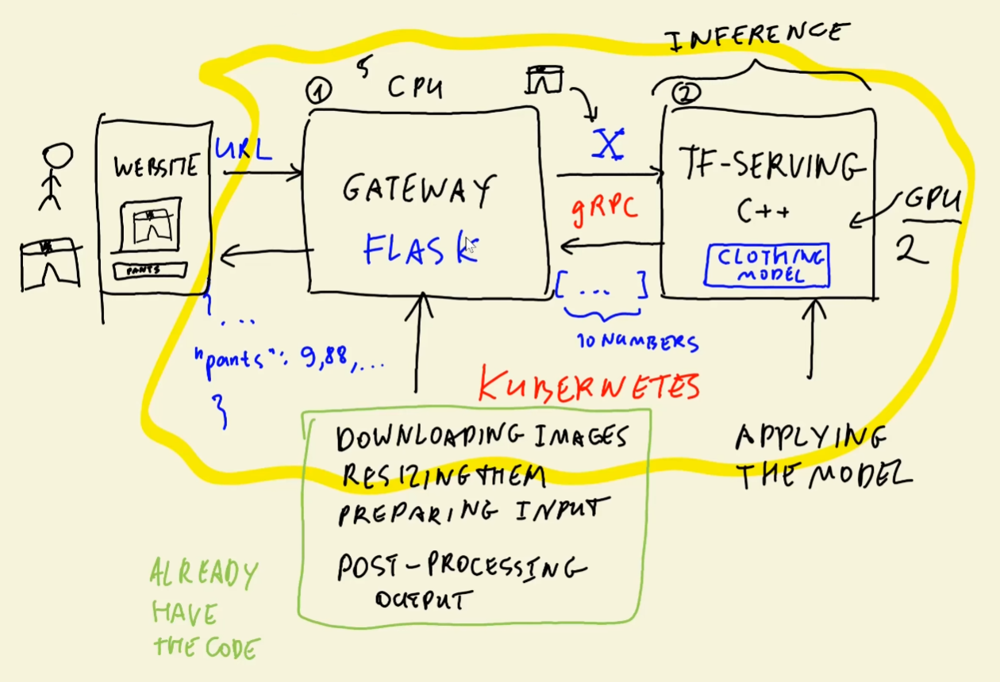

# 10.2 - TensorFlow Serving

[TF-Serving](https://www.tensorflow.org/tfx/guide/serving) is a lightweight, official distribution just for serving Tensorflow models
- Made just for inference, and written in C++ to be very efficient
- Flexible, high-performance and designed for production environments

Can be loaded with Tensorflow or Keras formats, and containerized with Docker



Need to convert model from last section to the Keras **SavedModel** format
- Can save with `wget https://github.com/alexeygrigorev/mlbookcamp-code/releases/download/chapter7-model/xception_v4_large_08_0.894.h5`

## Conversion
Can convert with `ipython` in the command line
- Import keras and tensorflow
- Load with keras
    - `model = keras.models.load_model("./clothing-model-v4.h5")`
- Convert with `saved_model.save()`
    - `tf.saved_model.save(model, 'clothed-model')`
    - Second parameter is desired name
- Files get saved to new directory

## Inspecting converted files
Can install CLI command `tree` to see directory structure
- `tree <folder>`
    - ```clothed-model/
        ├── assets
        ├── saved_model.pb
        └── variables
            ├── variables.data-00000-of-00001
            └── variables.index
        ```
- Or `ls -lhR clothing-model`

Can see more info about SavedModel with `saved_model_cli show --dir <directory> --all`
- There is a lot of this, but we are interested in the signature definitions: `signature_def`
- Grab the second:
    ```
    signature_def['serving_default']:
    The given SavedModel SignatureDef contains the following input(s):
        inputs['input_4'] tensor_info:
            dtype: DT_FLOAT
            shape: (-1, 150, 150, 3)
            name: serving_default_input_4:0
    The given SavedModel SignatureDef contains the following output(s):
        outputs['dense_3'] tensor_info:
            dtype: DT_FLOAT
            shape: (-1, 10)
            name: StatefulPartitionedCall:0
    Method name is: tensorflow/serving/predict
    ```
    - Signature name 'serving_default' is important and we will need it later
    - Below the signature definition, input info and output info are saved
        - Input is named 'input_8'
            - Can be arbitrary amount (-1) of 150 x 150 RGB (3-channel) images
        - Output is named 'dense_7'
            - Can be arbitrary amount of vectors of length 10
- Mark down:
    - `serving_default`
    - `input_8`
    - `dense_7`

## Serving locally

We will use docker to use the official image from Tensorflow:
- ```
    docker run -it --rm \
     -p 8500:8500 \
     -v "$(pwd)/clothing-model:/models/clothing-model/1" \
     -e MODEL_NAME="clothing-model" \
     tensorflow/serving:2.7.0
    ```
    - `-p`: Need to bind port 8500 of host machine to 8500 of container
    - `-v`: Need to mount SavedModel directory "clothing-model/" into "/models/clothing-model/1" in container
        - Requires them to be in unique folders with a version number
    - `-e`: Environment variable. Should be the name of th model
    - Lastly, the image to run (tensorflow/serving  @2.7.0)
- If it works it should say:
    ```
    2022-12-02 18:17:43.719379: I tensorflow_serving/model_servers/server.cc:409] Running gRPC ModelServer at 0.0.0.0:8500 ...
    [warn] getaddrinfo: address family for nodename not supported
    2022-12-02 18:17:43.723872: I tensorflow_serving/model_servers/server.cc:430] Exporting HTTP/REST API at:localhost:8501 ...
    [evhttp_server.cc : 245] NET_LOG: Entering the event loop ...
    ```

## Connnecting to Model
Recall: TF-Serving gRPC, not JSON. Need to install client.
- Make [notebook](../notebook.ipynb)
    - Install gRPC and Tensorflow-serving `!pip install grpcio==1.42.0 tensorflow-serving-api==2.7.0`
    - Install keras-image-helper if needed
- Access the Tensorflow host (`host = 'localhost:8500'`) via the grpc
    ```
    channel = grpc.insecure_channel(host)
    stub = prediction_service_pb2_grpc.PredictionServiceStub(channel)
    ```
    - This `stub` is the variable we will use to communicate
- Load image with keras-image-helper and the bit.ly URL we used before

Recall the 3 signature names we just wrote.
- Need `pb_request` variable with `predict_pb2.PredictRequest()`
- Need to pass this:
    - `model_spec.name`: 'clothing-model'
    - `model_spec.signature_name`: 'serving_default'
- And now we can send X with the input signature of the model
    - `pb_request.inputs['input_8'] = X`
    - This will fail - requires *Tensorflow Protobuf format*
        - Can do this with `tf.make_tensor_proto(data, shape=data.shape)`
        - Can make function
    - Change line to `pb_request.inputs['input_8'].CopyFrom(np_to_protobuf(X))`
        - Needs to copy as we do not assign directly, rather set a reference
- Can see the internals of protobuf looking at `np_to_protobuf(X)`
    - Starts with dtype
    - Then tensor shape (so 1 x 299 x 299 x 3 in dictionary)
    - Then binary encodeddata
- Can see what we will do by looking at `pb_request`
    - Shows model data and protobuf data

Now we can execute:
- Use `stub` to send `pb_request` with timeout of 20:
    - `pb_response = stub.Predict(pb_request, timeout=20)`
- Can look at `pb_response` to see info about output signature, output data and model
    - Can see just outputs with `pb_response.outputs['dense_7'].float_val`
- Now we just get a list of floats. Need to convert this
    - Good: same output as before

## Recap
1. Load model with Keras, convert to `SavedModel` format
    - Get model name/signature, input and output signatures
2. Load docker file with saved model directory
    - ```
        docker run -it --rm \
        -p 8500:8500 \
        -v "$(pwd)/clothing-model:/models/clothing-model/1" \
        -e MODEL_NAME="clothing-model" \
        tensorflow/serving:2.7.0
        ```
3. Invoke model from Jupyter
    - Preprocess image and convert to protobuf
    - Make gRPC request using signatures
    - Send, receive, interpret results

