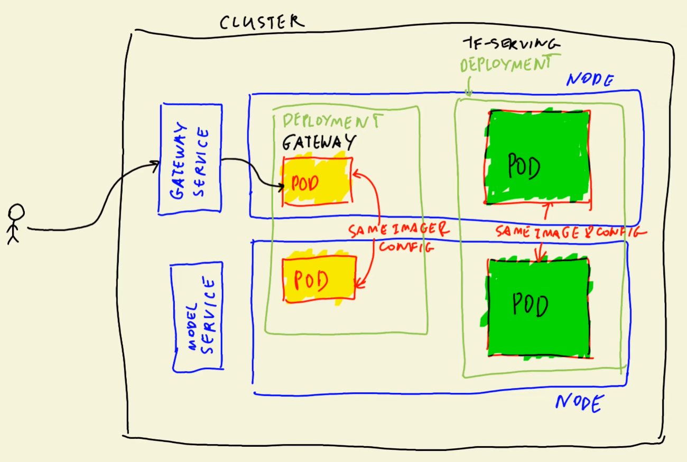

# 10.6 - Deploying a Simple Service to Kubernetes

Recall anatomy of cluster:

## Getting Ping application
We will configure a service and deployment for a "ping" application.
- Create new folder [`ping`](../ping/)
- Copy from [fifth section](../../05-deployment/code/ping.py)
- Type `touch Pipfile`
    - Forces Pipenv in this directory
    - Make pipenv: `pipenv install flask gunicorn`
- Copy Dockerfile from [fifth section](../../05-deployment/code/Dockerfile)
    - Adjust second `COPY` to only copy `ping.py`
    - Change `ENTRYPOINT` to say `ping:app`
- Build with `docker build -t ping:v001 .`
- Start with `docker run -it --rm -p 9696:9696 ping:v001`
- Test with `curl localhost:9696/ping`
    - Should get back `PONG`

## Installing Kubectl

Google Kubectl. Should be the first [result](https://kubernetes.io/docs/tasks/tools/).
- If you are on WSL and are using Docker Desktop, you should already have kubectl.
- Alexey installs WSL from [AWS](https://docs.aws.amazon.com/eks/latest/userguide/install-kubectl.html)

Google kind Kubernetes. Click the first [result](https://kind.sigs.k8s.io/)
- Go to Quickstart > Installation > Installing from Release Binaries
- Install for Linux

Create cluster with `kind create cluster`
- Takes a while the first time as the images are not yet cached.
- Now have to configure kubectl context to access "kind-kind" cluster
    - `kubectl cluster-info --context kind-kind`
- See what is running with:
    - `kubectl get service`
    - If you look for pod or deployment there is nothing
    - Can see the pods in docker
        - `docker ps`
- Made for testing Kubernetes locally

## Making Kubernetes deployment
Can install Kubernetes VS Code extension to make things easier
- Create file [deployment.yaml](../ping/deployment.yaml)
- Start typing `deploy` and hit tab on the suggestion
    - Change the name at first to `ping`
    - Some explanations:
        - `metadata` is the name of the deployment
        - `spec/template/spec` right above `containers` is the name of the pod
        - Not 100% true. But try adding -deployment and -pod to thes respectively
        - `spec/template` is a template for each pod
        - `spec/template/spec/containers` is the container itself
            - `image` should be `ping:v001`
            - `resources/limits/cpu` should be "0.5" or "500m" which is no more than half a CPU
            - `ports` should be 9696, as per the Flask application
        - `spec/template/metadata` is metadata given to a pod
            - `labels/app` means each gets a label 'app' with value "ping"
        - `sepc/selector/matchLabels` means any pod with that specific label is part of this deployment
            - Thus is the same as `spec'/template/metadata/labels/`
        - We can specify `spec/replicas` to choose the number of pods to spin up
            - Set to 1
- Now we want to apply this deployment
    - Run `kubectl apply -f deployment.yaml`
- Can see status with `kubetl get deployment`
    - It shows 0/1 pods ready
    - Check with `kubectl get pod`
    - There seems to be some error
        - Status shows ErrImagePull
- Can see more info with `kubectl describe pod <pod name>` 
    - Scroll up and can see the image trying to pull
    - Error messages at the bottom:
        - `Failed to pull image "ping:v001": rpc error: code = Unknown desc = failed to pull and unpack image "docker.io/library/ping:v001": failed to resolve reference "docker.io/library/ping:v001": pull access denied, repository does not exist or may require authorization: server message: insufficient_scope: authorization failed`
    - In our case we need to load the image into the cluster
- See the [quickstart](https://kind.sigs.k8s.io/docs/user/quick-start/#loading-an-image-into-your-cluster)
    - Run `kind load docker-image ping:v001`
- Pod should be running okay now

## Testing pod
Now we have to make the service
- But, we can test the pod before making a service
- Need to use kubectl to port-forward the pod for us 
    - Run `kubectl get pod` to get pod name
    - Run `kubectl port-forward <pod-name> 9696:9696`
        - Binds localhost:9696 to that of the pod
    - Each time you run `curl localhost:9696/ping`:
        - You can see `Handling connection for 9696` in the pod logs

## Creating service
Create file [service.py](../ping/service.yaml)
- Create it by typing `service` and choosing the suggestion
    - `metadata` is the name of the service
    - `spec/selector` is the labels pods need to qualify for forwarding requests
        - Should be same as `spec/template/metadata/labels` for the pod
    - Now the service knows which pods to forward to
    - Fill in the ports:
        - `targetPort` - port on the pod (9696)
        - `port` - port of the service
            - Set to port 80 for HTTP
            - Will route anything hitting port 80 to pod port 9696
- Make adjustments and apply to kube
    - `kubectl apply -f service.yaml`
- Can see it running with `kubectl get service`
    - Can also see it with `kubectl get svc`
- Ping has a "ClusterIP"
    - ClusterIP is an internal service.
    - An external service would be e.g load balancer
- Since we are using Kind, it does not really matter, but it will for a real service
    - Set `spec/type` to LoadBalancer
    - Apply this and then check services again
        - `TYPE` should be `LoadBalancer` so Cluster-IP is different
        - EXTERNAL-IP will never actually load here as we have not set an external IP
            - Would have to do this with EC2 or EKS or something
- Pretend we do have an external IP and bind it 
    - Run `kubectl port-forward service/ping 8080:80`
    - Now you can hit it from `curl localhost:8080/ping`
- Now we are hitting localhost:8080 -> service:80 -> pod:9696

## Recap

1. Make ping/pong application
2. Made Dockerfile
3. Installed kubectl/kind
4. Made cluster with kind/kubectl
5. Made deployment of ping/pong
6. Made service for this deployment
7. Port-forwarded service locally and tested