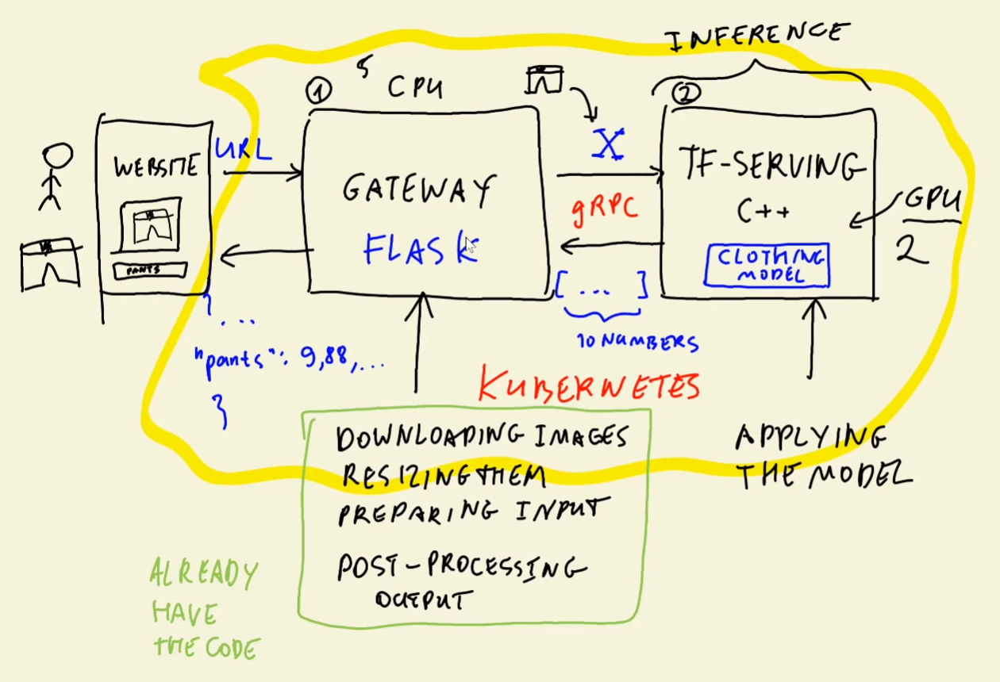

# 10.7 - Deploying TensorFlow Models to Kubernetes

We will now use Kubernetes to deploy the Gateway and model with TF-serving
- Recall TF-serving is an efficient method in C++ for serving models
    - Gateway takes images, preprocesses, and uses gRPC to send to TF-serving
- Gateway service should be external, TF-serving should be internal

## Creating model Deployment and Service
Want to replicate what we did with the [docker compose file](../docker-compose.yaml) in Kubernetes
- Create folder kube-config
    - Create file [`kube-config/model-deployment.yaml`](../kube-config/model-deployment.yaml)
    - Automatically create model deployment yaml
        - Edit name to `tf-serving-clothing-model`
        - Change first container to image `zoomcamp-10-model:xception-v4-001`
        - Add more memory and 1 CPU
        - Set port 8500
    - Load image with `kind load docker-image zoomcamp-10-model:xception-v4-001`
    - Apply the deployment yaml: `kubectl apply -f model-deployment.yaml`
- Adjust the ping deployment to use less memory and CPU
    - Delete the deployment then apply it again
- Adjust [gateway.py](../gateway.py) to test the service via URL
    - Should work, but takes a few seconds to run
- Close port-forward

Create [model-service.yaml](../kube-config/model-service.yaml)
- Edit it:
    - Adjust `name` and `app` to `tf-serving-clothing-model`
    - Adjust `image` to `zoomcamp-10-gateway:002`
    - Adjust the ports to be `8500`
    - Don't need to add `ClusterIP`
- Apply the service yaml
- Port forward the pod
- Test with gateway.py
    - Should work, just a little slow again

## Creating gateway Deployment and Service
Create file [gateway-deployment.yaml](../kube-config/gateway-deployment.yaml)
- As usual, automatically create file
    - Adjust name to `gateway`
    - Give it only a tenth of a CPU
    - Open port `9696`
    - Add environment variable for TF-model name
        - Add `spec/template/spec/containers/env`
            - Need to adjust the IP for K8s rather than docker-compose
            - `name` is 'TF_SERVING_HOST'
            - `value` is 'tf-serving-clothing-model.default.svc.cluster.local:8500'
                - **Kubernetes IPs are always of the form `<NAME>.default.svc.cluster.local:<port>`**
- Load docker image with `kind load -n clothing-model docker-image zoomcamp-10-gateway:002`

Let's log into the ping pod to test connection with the tf-serving pod
- Log in with `kubectl exec -it <pod name> -- bash`
    - `-it` is the same as docker, 'interactive terminal'
    - `--` means to run a command. Running bash let's us enter the pod
- Can see the files with `ls`
    - Want to try accessing the K8s IP `tf-serving-clothing-model.default.svc.cluster.local:8500`
    - First check that curl works:
        - `apt update`
        - `apt install curl`
        - `curl localhost:9696/ping`
        - If this takes too long, give ping deployment more resources (double CPU/RAM)
    - What we are doing is sending a request withing the same container
    - Now we want to send a request to the container using the ping service
        - `curl ping.default.svc.cluster.local:80/ping`
        - Port 80 is optional as it is the default HTTP port
    - Now do the same for the tensorflow service
        - Can't just curl as the Tensorflow application will not pay attention
        - Can do so with `telnet`
            - `apt install telnet`
            - Very low level library, allows you to connect to any port and send something 
        - Run `telnet tf-serving-clothing-model.default.svc.cluster.local 8500`
            - Can try something but application won't understand and will close service
- Works. Log out of pod

Apply gateway deployment
- Port forward the gateway pod
- Try using [`test.py`](../test.py) to test
    - Should get an error with the JSON
    - Check the logs for the gateway pod

Make [`gateway-service.yaml`](../kube-config/gateway-service.yaml)
- Change name to `gateway` and map ports `80` to `9696`
- Apply service yaml
- Check with `kubectl get service`
    - Notice type is `ClusterIP` and not `LoadBalancer`. Fix this.
- Now LoadBalancer. External-IP pending is normal
    - If there was an External-IP we would use it for the test.py file
- Port forward the gateway service from 8080:9696
- Test but use URL 'http://localhost:8080/predict' instead

## Note about gRPC
Kubernetes does not support load balancing gRPC out-of-the-box
- Googled 'kubernetes load balancer grpc'. First [link](https://kubernetes.io/blog/2018/11/07/grpc-load-balancing-on-kubernetes-without-tears/) mentioned Tears
    - Page describes that not all pods will get the same amount of requests
    - K8s does not evenly distribute load out-of-the-box
- Article shows how to solve this problem

## Recap
1. Created deployment for tf-serving model
2. Created service for tf-serving model
3. Logged into another pod and tried access tf-serving service
4. Created deployment for gateway
    - Importantly, specified DNS env variable
5. Created service for gateway
6. Tested locally by forwarding gateway service port
    - Tested by sending request with image